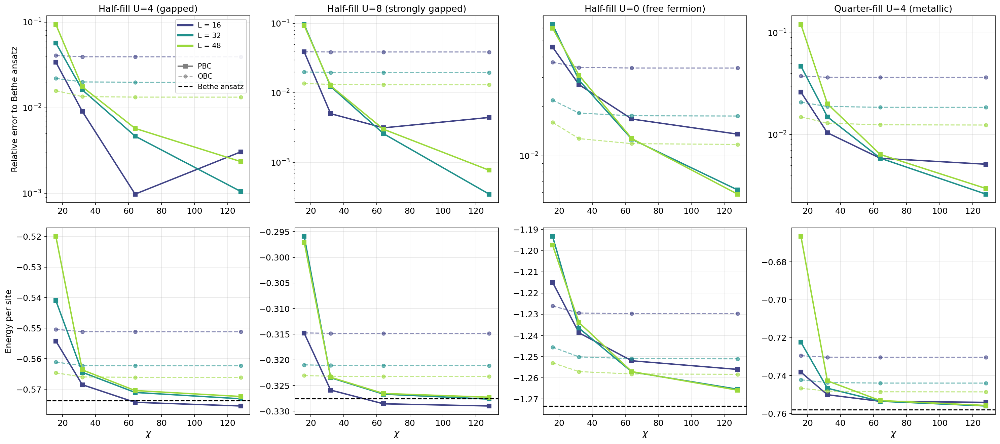
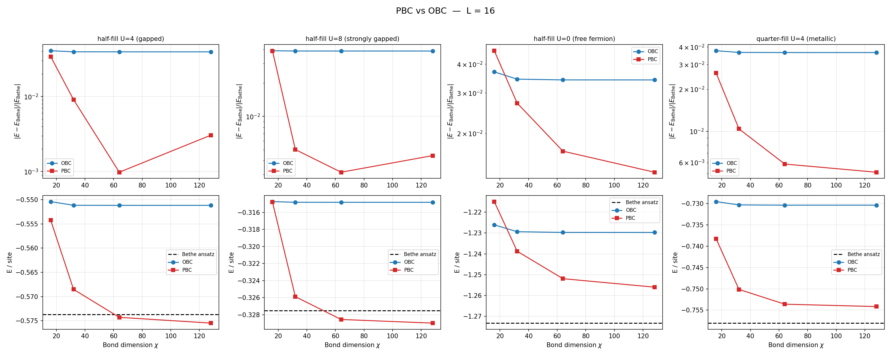
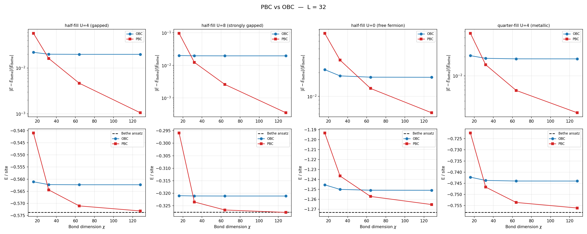
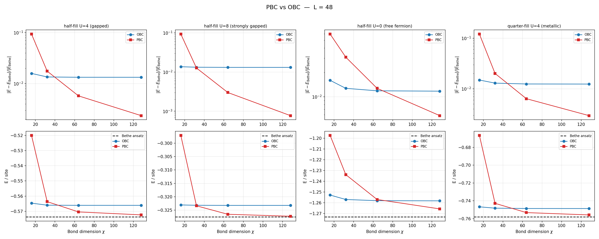

# PBC vs OBC Finite DMRG: Finite-Size Scaling Analysis

## Motivation

The finite DMRG pipeline (used as a reference in Fig 2) currently uses **open boundary conditions** (OBC). OBC introduces edge effects that scale as ~1/L and dominate the error budget at moderate system sizes. We implemented a **periodic boundary condition** (PBC) variant using TenPy's `order='folded'` site ordering and benchmarked it against the exact Bethe ansatz (Lieb-Wu solution, thermodynamic limit).

The key question: can we run PBC finite DMRG at practical system sizes and bond dimensions, and how much does it improve over OBC?

## Method

- **Model**: 1D Hubbard chain, `RealSpaceHubbard1D_PBC` (inherits `CouplingMPOModel` only, drops `NearestNeighborModel` to accommodate the long-range wrap-around MPO bond)
- **Boundary conditions**: `bc='periodic'`, `bc_MPS='finite'`, `order='folded'`
- **Filling**: Fixed via canonical ensemble (`cons_N='N'`)
- **Reference**: Bethe ansatz `lieb_wu_energy_general_filling()` — exact ground state energy per site in the thermodynamic limit (L -> infinity)
- **System sizes**: L = 16, 32, 48
- **Bond dimensions**: chi = 16, 32, 64, 128
- **Regimes tested**:
  - Half-filling U=4 (gapped, Mott insulator)
  - Half-filling U=8 (strongly gapped)
  - Half-filling U=0 (free fermion, gapless)
  - Quarter-filling U=4 (metallic, gapless)

## Results

### Combined convergence plot

**Top row**: Relative error to Bethe ansatz vs bond dimension chi. **Bottom row**: Absolute energy per site. Viridis color progression: lighter = smaller L, darker = larger L. Solid lines with square markers = PBC, dashed lines with circle markers = OBC. Black dashed line = Bethe ansatz (exact, thermodynamic limit).

### Per-system-size plots

| L = 16 | L = 32 | L = 48 |
|--------|--------|--------|
|  |  |  |

### Numerical results

#### L = 16

| Regime | OBC chi=128 | PBC chi=64 | PBC chi=128 |
|--------|-------------|------------|-------------|
| Half-fill U=4 (gapped) | 3.93% | 0.10% | 0.31% |
| Half-fill U=8 (strongly gapped) | 3.88% | 0.31% | 0.44% |
| Half-fill U=0 (free fermion) | 3.42% | 1.67% | 1.35% |
| Quarter-fill U=4 (metallic) | 3.65% | 0.59% | 0.51% |

#### L = 32

| Regime | OBC chi=128 | PBC chi=64 | PBC chi=128 |
|--------|-------------|------------|-------------|
| Half-fill U=4 (gapped) | 1.99% | 0.47% | **0.11%** |
| Half-fill U=8 (strongly gapped) | 1.96% | 0.26% | **0.03%** |
| Half-fill U=0 (free fermion) | 1.75% | 1.26% | 0.62% |
| Quarter-fill U=4 (metallic) | 1.85% | 0.59% | **0.26%** |

#### L = 48

| Regime | OBC chi=128 | PBC chi=64 | PBC chi=128 |
|--------|-------------|------------|-------------|
| Half-fill U=4 (gapped) | 1.33% | 0.57% | **0.24%** |
| Half-fill U=8 (strongly gapped) | 1.31% | 0.30% | **0.08%** |
| Half-fill U=0 (free fermion) | 1.17% | 1.27% | 0.59% |
| Quarter-fill U=4 (metallic) | 1.24% | 0.64% | **0.30%** |

### Timing (L = 48, chi = 128)

| Regime | OBC time | PBC time | Slowdown |
|--------|----------|----------|----------|
| Half-fill U=4 | 86s | 451s | 5.2x |
| Half-fill U=8 | 59s | 350s | 5.9x |
| Half-fill U=0 | 276s | 325s | 1.2x |
| Quarter-fill U=4 | 244s | 407s | 1.7x |

## Key observations

### 1. OBC error is dominated by boundary effects, not bond dimension

OBC energies saturate at chi ~ 32 and show no improvement at higher chi. The residual error is entirely from edge effects, scaling as ~1/L (3-4% at L=16, ~1.3% at L=48).

### 2. PBC eliminates boundary effects

PBC error reflects genuine finite-size effects plus chi-convergence error. At chi=128, PBC reaches 0.03-0.6% across all regimes — an order of magnitude better than OBC at the same system size.

### 3. PBC needs chi >= 32 to outperform OBC

At chi=16, PBC is often *worse* than OBC (especially at larger L) because the bond dimension is too small to handle the wrap-around entanglement (the chi-squared penalty). By chi=64, PBC consistently dominates.

### 4. Gapped systems converge faster

The Mott insulating regimes (U=4, U=8 at half-filling) reach sub-0.3% error at chi=128 for all system sizes. Gapless regimes (U=0, quarter-filling) converge more slowly, consistent with the logarithmic entanglement growth.

### 5. Some non-monotonic PBC errors

Occasionally PBC at chi=128 is slightly worse than chi=64 (e.g., L=16 U=8: 0.31% -> 0.44%). This suggests the DMRG is getting trapped in local minima at higher chi. The mixer may need more sweeps for these cases.

### 6. Computational cost is manageable

PBC is 2-6x slower than OBC at the same chi. The most expensive run (L=48, chi=128, gapped) takes ~7.5 minutes. A full Fig 2 parameter sweep at L=48 with chi=128 PBC would be feasible on a single CPU.

## Main takeaway

**At L=48 with PBC and chi=128, the finite-size error relative to the thermodynamic Bethe ansatz is ~1% (conservatively ~1.5%).** This is achievable in reasonable wall-clock time (~5-7 min per DMRG point). The error is dominated by genuine finite-size effects, not boundary artifacts or insufficient bond dimension.

For comparison, OBC at L=48 with any chi gives ~1.3% error that cannot be reduced without increasing L.

## Technical notes

- The PBC model class `RealSpaceHubbard1D_PBC` drops `NearestNeighborModel` from the inheritance chain because the wrap-around coupling (site 0 to site L-1) is long-range in MPS ordering, incompatible with nearest-neighbor storage.
- The `order='folded'` site ordering (0, L-1, 1, L-2, ...) reduces the MPO bond dimension by turning the wrap-around into a nearest-neighbor coupling in MPS space. This does not eliminate the chi-squared MPS bond dimension penalty, which is fundamental to PBC on an open MPS.
- The reference is the thermodynamic Bethe ansatz, not a finite-size Bethe ansatz. The measured errors therefore include both chi-convergence error and genuine 1/L finite-size corrections.

## Follow-up

- Redo this chi benchmarking for the actual (U, V, filling) values used in Fig 2 to confirm the PBC error budget for the paper's parameter regime.
- Investigate the non-monotonic chi convergence (mixer tuning, increasing `min_sweeps`).
- Consider whether finite-size Bethe ansatz (solving the Bethe equations at finite L with PBC) would provide a tighter reference to isolate chi-convergence error from finite-size error.

## Files

| File | Description |
|------|-------------|
| `aah_code/real_space_dmrg.py` | `RealSpaceHubbard1D_PBC`, `get_gnd_pbc()`, `get_gnd_fixed_filling_pbc()` |
| `sandbox/pbc_convergence.py` | Benchmark script |
| `sandbox/pbc_convergence_results.pkl` | Raw numerical results |
| `sandbox/pbc_convergence_combined.png` | Combined convergence plot |
| `sandbox/pbc_convergence_L{16,32,48}.png` | Per-system-size plots |
